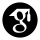
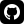
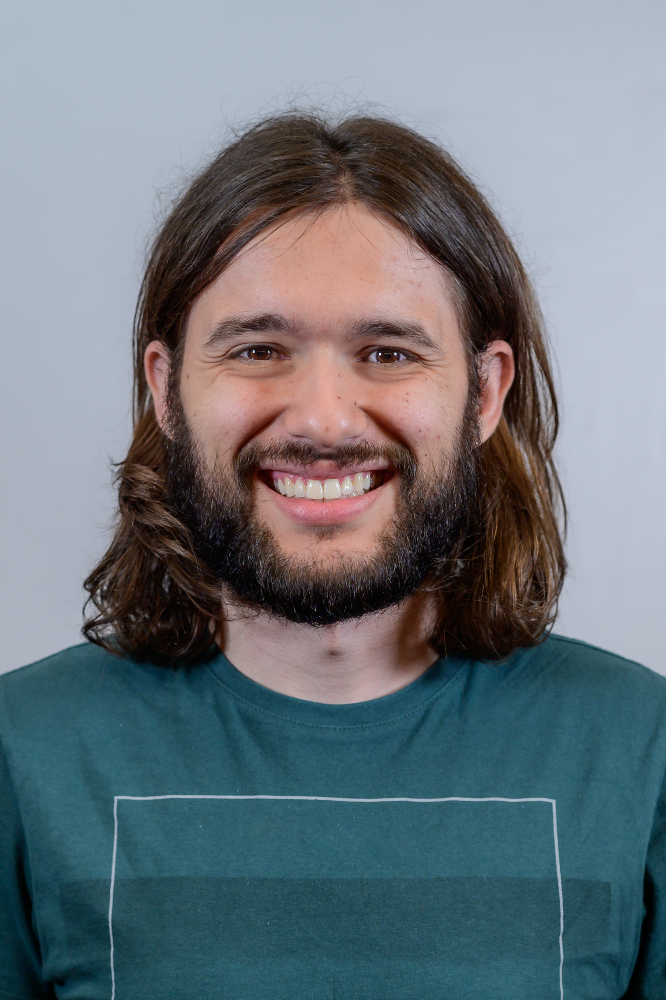

### Physicist

    

### About me

> My name is Leonardo Assis Morais, and I am a physicist, passionate about quantum physics. I have worked with simulations of quantum systems, generation and detection of single photons, instrumentation for quantum optical labs, and open quantum systems.
